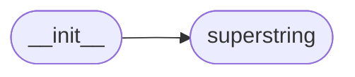

# Code Overview

[_Documentation generated by Documatic_](https://www.documatic.com)

<!---Documatic-section-Codebase Structure Python-start--->
## Codebase Structure Python

The codebase has a flat structure, with 2 code files.

<!---Documatic-block-system_architecture-start--->

<!---Documatic-block-system_architecture-end--->

# #
<!---Documatic-section-Codebase Structure Python-end--->

<!---Documatic-section-Key Objects-start--->
## Key Objects

There are exposed imports at level-0
from the source directory (superstring)

<!---Documatic-block-superstring-start--->

	
<code>superstring</code> (Click to Expand!)

* `superstring.superstring.SuperString`

<!---Documatic-block-superstring-end--->

# #
<!---Documatic-section-Key Objects-end--->

<!---Documatic-section-Important Functions-start--->
## Important Functions

<!---Documatic-block-important_funcs-start--->
<!---Documatic-block-end_user_funcs-start--->
### End User Exposed Functions

* superstring.superstring.SuperString
<!---Documatic-block-end_user_funcs-end--->
<!---Documatic-block-important_funcs-end--->

# #
<!---Documatic-section-Important Functions-end--->

<!---Documatic-section-Class Hierarchy-start--->
## Class Hierarchy

<!---Documatic-block-object-start--->

	
<code>object</code> (Click to Expand!)

* superstring.superstring.SuperStringBase

<!---Documatic-block-object-end--->

<!---Documatic-block-superstring.superstring.SuperStringBase-start--->

	
<code>superstring.superstring.SuperStringBase</code> (Click to Expand!)

* superstring.superstring.SuperString
* superstring.superstring.SuperStringConcatenation
* superstring.superstring.SuperStringLower
* superstring.superstring.SuperStringSubstring
* superstring.superstring.SuperStringUpper

<!---Documatic-block-superstring.superstring.SuperStringBase-end--->

# #
<!---Documatic-section-Class Hierarchy-end--->

[_Documentation generated by Documatic_](https://www.documatic.com)